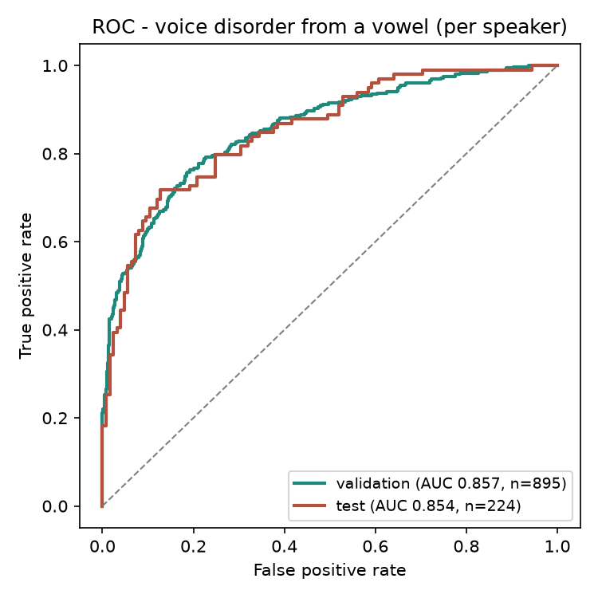

# Voice AI: detecting a voice disorder from a sustained vowel

A voice-AI model that listens to one sustained "aaah" and predicts whether the
speaker has an organic voice disorder. **AUC 0.854 on a held-out test set of 224
speakers the model never saw during training or tuning.**

## Try the live demo

```bash
pip install -r requirements.txt
python main.py train     # trains the model once (a few minutes) -> outputs/model.pkl
python main.py serve     # then open http://localhost:5000
```

A small web app (Flask, not Streamlit). Click **record**, say "aaah" for a few
seconds, and it extracts the voice features and returns a live prediction with a
likelihood meter. You can also upload a `.wav`. This is the interactive way to
test the model; the pipeline below is what produced it.

## Deploying it

The demo is split across two hosts, because GitHub Pages serves static files
only and the prediction needs a Python process: **the page goes on Pages, the
scoring API goes on Render.**

**Backend (Render).** New → Web Service → connect this repo. [render.yaml](render.yaml)
supplies the build and start commands, the health check, and the allowed CORS
origin, so the defaults it offers are already correct. `outputs/model.pkl` is
committed, so nothing needs training on the server. Set `ALLOWED_ORIGINS` to your
Pages origin if it differs from the default.

**Frontend (GitHub Pages).** Set `BACKEND` at the top of the script in
[docs/index.html](docs/index.html) to the Render URL, commit, then Settings →
Pages → Deploy from a branch → `main` / `/docs`.

[docs/index.html](docs/index.html) is a deployed copy of
[templates/index.html](templates/index.html), not a replacement — `python main.py serve`
still runs the whole thing from one process locally. Edits to the demo page need
applying to both.

## The pipeline

Everything lives in **`main.py`**, one subcommand per stage:

```bash
python main.py collect --audio-dir path/to/audio   # raw .wav files -> feature table
python main.py train                               # train, validate, score the test split
python main.py graphs                              # ROC, confusion matrix, feature importance
python main.py serve                               # the web demo above
python main.py all                                 # train, then graphs
python predict.py your_voice.wav                   # score one recording from the CLI
```

| Stage | What it does |
|---|---|
| **collect** | Walks a folder of labelled recordings, extracts the 88 eGeMAPS features from each with openSMILE, and writes the feature table. Expects `healthy/` and `pathological/` subfolders; a speaker's recordings are grouped either by their own subfolder or by the filename prefix. |
| **clean / preprocess** | `load_features()` drops duplicate rows, median-fills missing values, and removes constant columns. Inside the model, `SimpleImputer` + `StandardScaler` run per training fold, so no test statistics leak in. |
| **train** | SVM-RBF, class-weighted for the healthy/pathological imbalance. |
| **validate** | 5-fold cross-validation **grouped by speaker** on the development set, plus a 2,000-resample bootstrap CI. |
| **test** | 20% of speakers are held out before anything else and scored exactly once. |
| **graphs** | ROC (validation and test on one plot), confusion matrix, top-15 features by mutual information. |
| **serve / predict** | Audio in, probability out: the browser demo and the CLI equivalent. |

## Results

| Split | Speakers | Recordings | AUC (per speaker) | 95% CI | Accuracy |
|---|---|---|---|---|---|
| Validation (cross-validated) | 895 | 12,373 | 0.857 | [0.832, 0.882] | 0.787 |
| **Held-out test** | **224** | **3,182** | **0.854** | [0.805, 0.901] | 0.795 |

The two agree closely, which is the point of keeping them separate: it means the
cross-validated number wasn't flattering itself. The test speakers were removed
before any training or tuning happened and scored a single time.



## Why per-speaker matters

Each speaker records the vowel about 14 times. Two decisions make the numbers
honest rather than impressive:

- **Splitting by speaker, never by recording.** If one person's recordings landed on both sides of the split, the model could recognise the voice instead of the disorder. Every split here, the test holdout and the cross-validation folds alike, cuts between people.
- **Averaging a speaker's recordings into one decision.** Per single recording the AUC is ~0.77; pooling a speaker's vowels lifts it to ~0.85. That is the number reported above.

## Data

[Saarbrücken Voice Database](https://stimmdb.coli.uni-saarland.de/):
1,119 speakers, sustained-vowel recordings, with 88 eGeMAPS acoustic features
(pitch, jitter, shimmer, harmonics-to-noise ratio, formants, and spectral shape)
extracted per recording with openSMILE. The model uses acoustic features only;
no clinical questionnaire scores, which are the shortcut that inflates a lot of
published numbers on this dataset.

**The data is borrowed, not mine.** The recordings, the speakers, and the clinical
labels are the SVD's work, and this repository contributes the modelling code only.
The 88 features shipped in `data/` are a derivative of that database, reused under
its license, and the audio itself is not mirrored here (it is 38 GB; get it from
the [Zenodo record](https://doi.org/10.5281/zenodo.16874898)).

`main.py collect` is the step that turns that audio into the feature table, so
the pipeline runs end to end from raw recordings if you download them, or on any
other labelled vowel recordings you have.

See [data/README.md](data/README.md) for the full provenance, column layout,
required attribution, and BibTeX for the three works to cite:

> Pützer, M. & Barry, W. J. (2008). *Saarbruecken Voice Database* (Version v2)
> [Dataset]. Zenodo. https://doi.org/10.5281/zenodo.16874898
>
> Eyben, F. et al. (2016). The Geneva Minimalistic Acoustic Parameter Set (GeMAPS)
> for Voice Research and Affective Computing. *IEEE Transactions on Affective
> Computing*, 7(2), 190–202.
>
> Eyben, F., Wöllmer, M. & Schuller, B. (2010). openSMILE — The Munich Versatile
> and Fast Open-Source Audio Feature Extractor. *Proceedings of ACM Multimedia*,
> 1459–1462.

## What you need to run it

| | |
|---|---|
| `main.py` | the whole pipeline |
| `data/svd_boost_features.csv` | the feature table: required by `train`, or rebuild it with `collect` |
| `templates/index.html` | the demo page: required by `serve` |
| `outputs/model.pkl` | written by `train`, so train once before serving |
| `wsgi.py`, `render.yaml` | the deployed backend: gunicorn entrypoint and Render config |
| `docs/` | the deployed frontend, served by GitHub Pages |

## Licensing

Two licenses, covering different things:

| | |
|---|---|
| **Code** (`main.py`, `predict.py`, `wsgi.py`, `templates/`, `docs/`) | MIT (see [LICENSE](LICENSE)) |
| **Data** (`data/`) | CC BY 4.0, inherited from the SVD (see [data/README.md](data/README.md)) |

Neither license extends to the other. If you redistribute the feature table or
anything derived from it, CC BY 4.0 requires that you carry the attribution and
the statement of changes in [data/README.md](data/README.md) along with it.

*This is a research project and a screening aid, not a medical device and not a
diagnosis. Do not use it to make clinical decisions.*